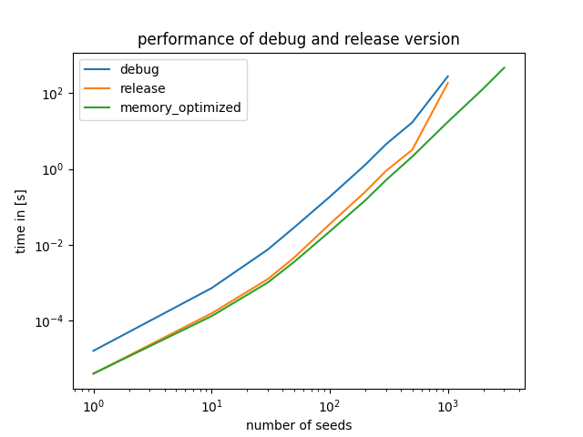
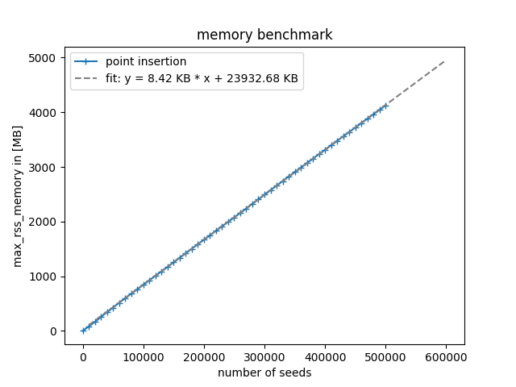

# voronoi_mesh_project
Small C++ Project to generate a voronoi mesh using half plane intersection and point insertion. Still work in progress...

### Ideas
- Compiler Flags?
- README with explenation how to use 
- Different sorting of points?
- rethink adapt_cells in point insertion
- progress bars?


### Time performance
The initial version of the program was still very slow with an O(n^3) scaling. The newer version of the algorithm had an O(n^2) scaling and is no longer memory limited. This is the expected scaling for half plane insertion. The next algorithm is point insertion and has a way better scaling. When one additionally sorts the poins before generating the grid the scaling is O(nlogn). Here the program again becomes memory limited again, because it is way faster than before.



### Memory usage
Memory usage for the point insertion algorithm. One can see, that the memory scales linearly. The memory limit could be pushed back by improving the program structure, but honestly i don't see much obvious and easy to implement memory improvement while still knowing the seeds, verticies and edges without recomputing lots of stuff. 




Some notes on memory usage vs time performance. Of course this is a trade of. Here are a few different options i tested. Lets say the benchmark is a standard code without recomputing anything using vectors.

- Changing to deque instead of vector: makes the program 70% faster, increases memory usage 10x
I would argue, that the memory optimization here is more important because the program is still more memory limited i guess.

### Getting started
Befor starting make sure you have the following installed:

- C++ with a working compiler
- CMake (optional one can manually build the project)
- Git (alternatively the git clone in the getting started can be replaced by just downloading the files manually)

For the visualization in python the following packages are needed:
- argparse, time, tqdm, matplotlib, numpy, PIL, scipy


Start by going into the folder where you want to clone the repository into and do:

```bash
git clone https://github.com/lucas56098/voronoi_mesh_project.git
```

Then go into the voronoi_mesh_project, create a build folder and go into that as well.

```bash
cd voronoi_mesh_project
mkdir build
cd build
```

In that folder build the program using cmake

```bash
cmake ..
cmake --build .
```

The program is now build and can be run using `./vmp`. For example one could try

```bash
./vmp -n 100 -fixed_seed 42 -image
```

If everything works fine the grid will be generated for 100 seeds and stored into `build/files`. Also the grid will be plotted using python and the final image will be stored as `figures/single_picture.pdf`.