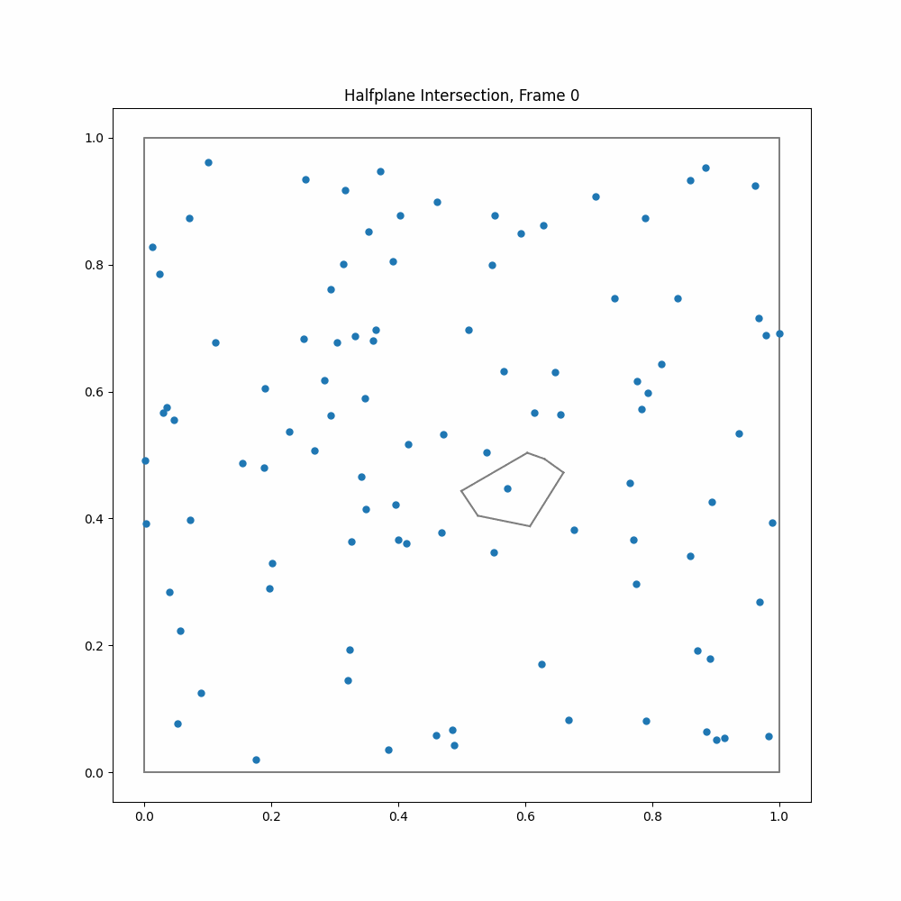

# Voronoi Mesh Project - vmp
Small C++ project to generate a Voronoi mesh using a naive halfplane intersection and point insertion algorithm. Optional also some visualisation and benchmarking tools are available. This work was done during an undergraduate project internship, in the Group of Dr. Dylan Nelson at ITA Heidelberg. If you want to learn more about the algorithms and how they work, read the first few segments as well. Otherwise feel free to just skip to the getting started part.

#### Table of contents
1. [Introduction](#introduction)
2. [Naive halfplane intersection](#naive-halfplane-intersection)
3. [Point insertion](#point-insertion)
4. [Performance and memory usage](#performance-and-memory-usage)
5. [Correctness checks](#correctness-checks)
6. [Getting started](#getting-started)
7. [Run options](#run-options)
8. [Acknowledgements](#acknowledgements)

<p align="left">
  
</p>

## Introduction
A `VoronoiCell` is a polygonal region surrounding a specific point in space, encompassing all locations that are closer to that point than to any other point in a given set of points. The edges of that Voronoi cell are part of the perpendicular bisectors to the neighboring points. In the following, we will continue calling those perpendicular bisectors `Halfplane` and the midpoint of such a Voronoi cell `seed`. The Voronoi cells of all points in the set combined are called a `VoronoiMesh`. Voronoi meshes can be used in many applications. One such application for example are cosmological hydrodynamical simulations like [IllustrisTNG](https://www.tng-project.org) based on codes like [AREPO](https://github.com/dnelson86/arepo), where a moving Voronoi mesh is used as a grid for the hydrodynamics and therefore needs to be regenerated for every timestep. While moving Vornoi meshes, as a compromise between Smoothed Particle Hydrodynamics and Adaptive Mesh Refinement, help with shock treatment and also make the code gallilean invariant, this of course comes at a substantial computing cost. Fast and reliable algorithms for generating Voronoi meshes in 3D therefore are very useful to do such simulations. Due to the limited time of my project internship, we however stuck to 2D algorithms.
Voronoi mesh generation algorithms can be divided into direct and indirect algorithms, where the indirect algorithms first generate a Delaunay triangulation and then use the geometric duality to the Voronoi tesselation to construct the mesh. While codes like [AREPO](https://github.com/dnelson86/arepo) work using an indirect approach we focused on directly generating a Voronoi mesh.
The two algorithms we looked at, are a naive halfplane intersection algorithm which at best scales with $\mathcal{O}(n^2)$ and a point insertion algorithm that at best scales with $\mathcal{O}(n\log{n})$.

### Folder structure
In the main folder, there is the C++ program with its header files and the Python file for visualisation. 
- `./figures` : here the outputs of any visualisation will be saved (e.g. image, benchmark, mmanim, gganim)
    - `./figures/readme_figures` : here are the images for the readme 
- `./build` : this will be the folder where you will build your executable into
    - `./build/files` : here you will find any saved mesh files stored in edge-, verticie- and seedfiles
    - `./build/benchmarks` : if you do a benchmark here the raw files will be saved. The plots however still are in `./figures`

### Object structure and methods
To get a brief overview of the program structure we first look at the objects. There is a `Point` object that just stores an x and y value. Two such points can be used to initialize a `Halfplane` (which, strictly speaking, in 2D is just a straight line) which is the perpendicular bisector between the two points. In the halfplane itself, the midpoint between the two initializing points and a normed vector pointed along the halfplane are stored. Additionally the different objects store indices to find them easily in the different data structures, but I'll skip over that here.
A `VoronoiCell` is an object consisting of a seed point, an array of vertices (also points),  an array of edges (the final halfplanes) and an array of halfplanes, needed for the construction, which after the mesh generation is cleared. The Voronoi cells are stored in a `VoronoiMesh` in a vcell array. In addition to those objects, there is a structure called `intersection` to store some information when intersecting two halfplanes (e.g. intersecting point).

Some geometrical operations are essential to the algorithms and therefore deserve to be discussed in advance.
- First, there is `intersect_two_halfplanes()` where the first halfplane usually is the current halfplane and the second halfplane is the one to intersect. In 2D this reduces to solving a linear equation system evaluating some determinants. For the intersection we store the intersecting point, the second halfplane and the signed distance (relative to the normed vector pointed along the halfplane) to the midpoint of the first/current halfplane.
- This way we can find the smallest positive intersection (`find_smallest_pos_intersect()`) by intersecting all the necessary halfplanes with the current halfplane and minimizing the distance to either the midpoint or the last vertex depending on the situation.

## Naive halfplane intersection
<p align="left">
  
  
</p>

The naive halfplane algorithm can be found in the `construct_mesh()` function of the `VoronoiMesh`. It is the slower of both algorithms, but conceptually easier to understand. The main idea is to start with a halfplane and then intersect all other possible halfplanes to find the next halfplane. This process repeats around the whole cell until it's fully constructed. As one can see in the right gif a cell is generated exactly once and then stays this way the whole time. This is a conceptual difference to point insertion, as we will later see. We now take a deeper look at the algorithm. For the halfplane intersection, one first determines the halfplane closest to the seed of the cell one wants to construct. This is the only halfplane where one can be sure, that its midpoint will be part of the edge of the cell. This halfplane will be part of the cell and can be stored. Starting from there one finds the halfplane intersection with the smallest positive distance relative to the midpoint of that first edge. This is done by intersecting the first edge with all other halfplanes that exist. The intersecting halfplane will be the next edge, that can be stored and their intersection will be a vertex. To repeat the process, the next edge becomes the current edge and instead of the midpoint we now use the vertex. Then the smallest positive intersection relative to the vertex is calculated and we continue as above. This process repeats until one returns to the first halfplane. The algorithm is also visualised in the left gif. Boundary handling here is reached by just adding four halfplane boundaries to the total list of halfplanes to be checked. This algorithm in total needs $\mathcal{O}(n)$ checks per cell with n cells. Thus this algorithm is $\mathcal{O}(n^2)$. We will check this in the performance benchmark later.

## Point insertion
<p align="left">
  
  
</p>

The point insertion algorithm can be found in the `do_point_insertion()` function of the `VoronoiMesh`. It is conceptually a bit more difficult and requires more focus on adapting the neighbouring cells and respecting boundary conditions. As shown in the right gif this algorithm inserts one seedpoint after another to make a new cell. This is done by doing halfplanes with the respecive neighbouring cells until the new cell is fully generated. After generating the new cell, the neighbouring cells need to be adapted. For this reason after constructing a cell, the cell will likely be changed multiple times in the algorithm. Conceptually for this algorithm it is sufficient to look a the process of inserting one seedpoint, because this process repeats again and again. If we want to insert one seedpoint into an already existing mesh, we first need to find out in which cell we currently are. For that there exists a `find_cell_index()` function that starts from some specified cell and from there jumps step by step towards the new seedpoint until it can't get closer. The cell it is in, then must be the cell where the seedpoint is in as well. This process can be massively optimized later on (see section on presorting seedpoints). When we know the cell we are in, we can construct the halfpane between the new seedpoint and the seedpoint of the cell we are in. This boundary will be part of the new cell. Now we want to find the intersection with the smallest positive distance relative to the midpoint out of all edges of the cell we are in. With that intersecting edge, we know which cell will be the next to use for constructing the new cell. The intersection with the edge gives us the vertex. Making a halfplane between the next cell seedpoint and the new cell seedpoint gives us the next edge. Instead of using the midpoint, we again use the vertex of the last intersection for the relative distances. This process can be repeated until we reach the first cell we started in again. Now that the new cell is constructed, we need to adapt the surrounding cells by clipping their edges according to where the intersections have been. The whole process is visualised in the left gif. Boundary handling here is more difficult than in the first algorithm, because when we reach a boundary there is no cell we can go into. Therefore we need special treatment here. The basic rule for that is to stay on the boundary as long as the leaving condition is not satisfied. The leaving condition is, that the halfplane between the new seedpoint and the seedpoint of the cell we are checking, intersects with the boundary inside of the checked cell. 
<p align="left">
  
  
</p>

In the left image, the leaving condition would be satisfied, while in the right image, the leaving condition for that cell wouldn't be satisfied. When the boundary is left, the algorithm continues normally as before. Given the `find_cell_index()` function is optimized, this algorithm scales with $\mathcal{O}(n\log{n})$.


### Presorting seedpoints
Presorting the seedpoints speeds up the `find_cell_index()` function by first setting the start index to the cell index of the last inserted cell. If the seedpoints are not sorted, this of course is not a good guess. But if the seedpoints are spatially closely sorted, this is a really good guess and can largely reduce the number of steps needed to reach the cell we're looking for. Here are a few examples of sorting, that are implemented in the command line interface (no sort, modulo sort, inout, outin). The modulo sort is the one with the best performance out of them. Some kind of Peano Hilbert curve or something similar might be even better, but is not implemented here. 
<p align="left">
  
  
  
  
</p>

### Degeneracy
A degeneracy occurs, when a vertex has more than three neighbours and thus the `find_smallest_pos_intersect()` function finds two or more halfplanes with the exact same smallest distance. Degeneracies are important to get right for a robust handling of special cases. 
However, the handling of exact degeneracies is very limited within this code. The naive halfplane intersection algorithm includes a handling for degenerate cases, by comparing the direction of the degenerate halfplanes and choosing the right one. In theory this should work and was also tested by me for some example degenerate cases. For highly degenerate cases, like a larger uniform grid, however artifacts start to occur. This seems kind of strange and thus this degeneracy handling needs to be handled with care. The point insertion algorithm at the moment does not come with degeneracy handling. Be aware of that. For "almost" degenerate cases up to 1e-13 the code runs without problems even though there is no degeneracy handling included. Here is an example of an almost uniform grid. The seedpoints vary by around 1e-13 from the uniform grid.
<p align="left">
  
</p>

## Performance and memory usage
For performance benchmarking, the time the generation took on my PC (MacBook Pro M1), was plotted as a function of seedpoints to generate. If you want to try some benchmarking for yourself feel free to use the `-benchmark` option in the command line interface. As one can see the algorithms scale as expected. In addition, also an even more naive halfplane intersection, scaling with $\mathcal{O}(n^3)$, is shown, which is not included in the final code. Also one can see, that the sorting of the seedpoints, according to the modulo sort, is the final piece in the puzzle, to achieve $\mathcal{O}(n\log{n})$ scaling. Otherwise, for very large seedpoint sets, the `find_cell_index()` function scales worse and it takes many steps to reach the cell, where the seedpoint is in. Regarding memory usage, some improvements can still be made, but it seems rather difficult to do this without the need to recompute variables or lose quick access to the vertices. The memory grows approximately linear which is as expected. In addition to that, the maximum RSS memory usage is still higher, than the final mesh size, because the generation algorithms also take up memory while running.
<p align="left">
  
  
</p>

## Correctness checks
Checking the mesh after generation, is an important part of verifying that the algorithm works as expected. For that, we try to check different properties a Voronoi mesh should have. We do the following checks: 

- `check_equidistance()`: Test, if every vertex has at least three equidistant seedpoints. (Definition of a vertex)
- `check_area()` : Compute the total area of all cells added up. (Should equal 1 up to some finite precision limits)
- `check_neighbours()` : Test, if every neighbour of a cell has that cell as a neighbour as well.

Checks can be activated using `-check` as an option in the command line interface. However one should note, that for large seedpoint sets the mesh generation is way faster, than the correctness checks. Therefore I would recommend using them, for very large seedpoint sets, only if really needed.

## Getting started
Before starting make sure you have the following installed:

- C++ with a working compiler (no additional packages needed)
- CMake (optional one can manually build the project)
- Git (alternatively one can manually download the files)

For the visualisation in Python, the following packages are needed :
- tqdm, matplotlib, numpy, Pillow, scipy

```bash
pip install tqdm matplotlib numpy Pillow scipy
```

(However, if no visualisation tools are used, the program also runs without an installation of Python)


Start by going into the folder where you want to clone the repository into and do:

```bash
git clone https://github.com/lucas56098/voronoi_mesh_project.git
```

Then go into the voronoi_mesh_project, create a build folder and go into that as well.

```bash
cd voronoi_mesh_project
mkdir build
cd build
```

In that folder build the program using cmake

```bash
cmake ..
cmake --build .
```

The program is now built and can be run using `./vmp`. For example, one could try:

```bash
./vmp -n 100 -fixed_seed 42 -image
```

If everything works correctly, the grid will be generated for 100 seeds and stored into `build/files`. Also, the grid will be plotted using Python and the final image will be stored as `figures/single_picture.pdf`. It should look something like this:
<p align="left">
  
  
</p>

## Run options
Now that we have a working installation, here is an overview of what you can do with the command line interface.

`-n [int N_seeds]`                  : specify the number of seedpoints 

`-fixed_seed [int rd_seed]`         : fix the random seed and specify it 

`-sort_option [int sort]`           : specify presorting of seedpoints

                     0 - no sort

                     1 - modulo sort (standard option)

                     2 - radially outward

                     3 - radially inward

`-check`                            : check mesh for correctness (for large seedpoint sets takes way longer than grid generation)

`-algorithm [int algorithm]`         : specify the algorithm used

                     0 - halfplane intersection O(n^2)

                     1 - point insertion O(nlogn) (standard option)

`-image`                            : plot the image of the mesh using Python matplotlib and save the file.

The next options are specific and not compatible with all of the options above!

`-benchmark`                        : benchmark algorithm, save benchmarking files and plot time and memory benchmark using python matplotlib

> [!IMPORTANT]  
> benchmarking is not compatible with -n, -check, -image, - gganim, -mmanim

`-mmanim [int N_frames] [int fps]`  : moving mesh animation, specify (frames) (fps)

> [!IMPORTANT]  
>  Moving Mesh Animation is not compatible with -sort_option, -check, -algorithm, -image, -benchmark, -gganim

`-gganim [int fps]`                 : grid generation animation, specify (fps)

> [!IMPORTANT]  
>  Grid Generation Animation is not compatible with -check, -image, -benchmark, -mmanim


If anything is unclear:

`-h`,`-help`,`--help`               : will show this list


## Acknowledgements
Many thanks to [Dylan](https://github.com/dnelson86) and [Chris](https://github.com/cbyrohl) from the Institute for Theoretical Astrophysics Heidelberg who guided me through this project and spent many hours discussing conceptual problems and brainstorming further ideas. 
It was a lot of fun!
