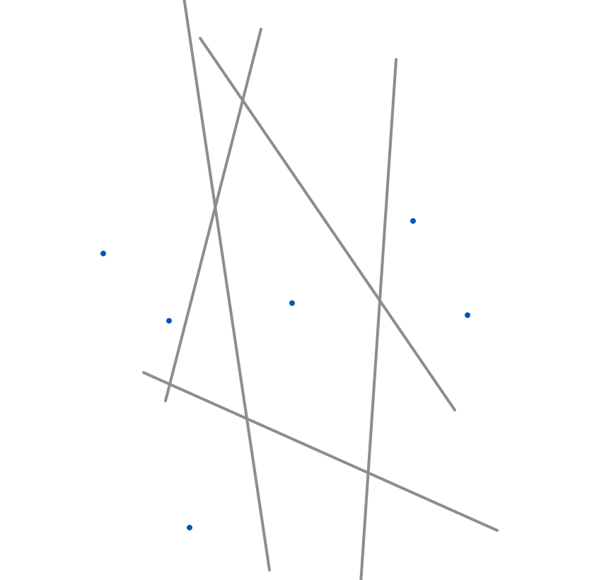
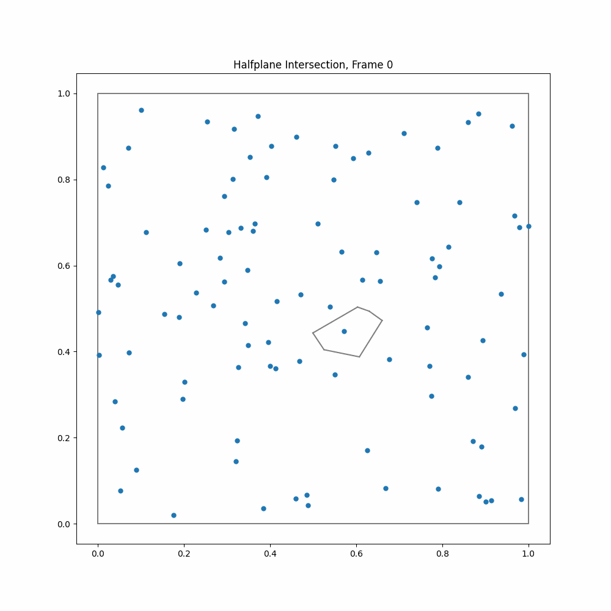

# Voronoi Mesh Project - vmp
Small C++ project to generate a voronoi mesh using a naive halfplane intersection and point insertion algorithm. Optional also some visualisaition and benchmarking tools are available. This project was done during an undergraduate project internship in the Group of Dr. Dylan Nelson at ITA Heidelberg. If you want to learn more about the algorithms and how they work read the introduction. Otherwise feel free to just skip to the getting started part.

#### Table of contents
1. [Introduction](#introduction)
2. [Getting started](#getting-started)
3. [Run options](#run-options)

## Introduction
Voronoi meshes can be used in many applications. One such application for example are cosmological hydrodynamical simulations 
like [IllustrisTNG](https://www.tng-project.org) based on codes like [AREPO](https://github.com/dnelson86/arepo), where a moving voronoi mesh is used as a grid for the hydrodynamics and therefore needs to be regenerated for every timestep. While moving vornoi meshes, as a compromise between SPH and AMR, help with shock treatment and also make the code gallilean invariant this of course comes at a substential computing cost. Fast and reliable algorithms for generating voronoi meshes in 3D therefore are very useful to do such simulations. Due to the limited time of my project internship we however sticked to 2D algorithms.
Voronoi mesh generation algorithms can be divided into direct and indirect algorithms, where the indirect algorithms first generate a delunay triangulation and then use the geometric duality to the voronoi tesselation to construct the mesh. While codes like [AREPO](https://github.com/dnelson86/arepo) work using an indirect approach we focused on directly generating a voronoi mesh.
The two algorithms we looked at are a naive halfplane intersection algorithm which at best scales with $\mathcal{O}(n^2)$ and a point insertion algorithm that at best scales with $\mathcal{O}(n\log{n})$. Many thanks do Dylan and Chris who guided me through this project. It was a lot of fun!

### Object structure and Methods
To get a brief overwiev of the program structure we first look at the objects. There is an `Point` object which basically just stores an x and y valaue. Two of such points can be used to initalize a `Halfplane` (which, strictly speaking, in 2D is just a straight line) which is the perpendicular bisector between the two points. In the halfplane itself the midpoint between the two initializing points and a normed vector pointed along the halfplane are stored. Additionaly the different objects store indices for better finding them in the different data structures but i'll skip over that here.
A `VoronoiCell` is an object consisting of a seedpoint, a vector of verticies (also points),  a vector of edges (the final halfplanes) and a vector of halfplanes needed for the construction which after generation is cleared. The voronoi cells are stored in an `VoronoiMesh` in a vcell vector. Additional to those objects there is a structure called `intersection` to store some informations when intersection two halfplanes (e.g. intersecting point).

There are some geometrical operations which are essential to the algortithms and therefore deserve to be discussed in advance.
- First there is `intersect_two_halfplanes()` where the first halfplane usually is the current halfplane and the second halfplane is the one to intersect. In 2D this reduces to solving a linear equation system evaluating some determinants. For the intersection we store the intersecting point, the second halfplane and the signed distance (relative to normed vector pointed along the halfplane) to the midpoint of the first/current halfplane.
- This way we can find the smallest positive intersection (`find_smallest_pos_intersect()`) by intersecting all the necessary halfplanes with the current halfplane and minimizing for the distance to either the midpoint or the last vertex depending on situation.

### Naive Halfplane intersection

  
  

The naive halfplane algorithm can be found as the `construct_mesh()` function of the `VoronoiMesh`.
gif of grid generation here also explainer gif

part on boundary handling

### Point insertion
The point insertion algorithm can be found as the `do_point_insertion()` function of the `VoronoiMesh`.
gif of grid generation here also explainer gif
part on boundary handling (with how to leave and the boundary test)

#### Presorting points

### Degeneracy

### Performance and memory usage

### Correctness checks

## Getting started

## Run options

### Checking the Mesh